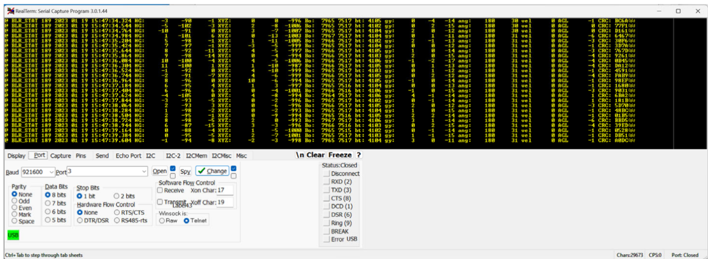

# Blue Raven USB Interface Guide (Revised)

_Comprehensive instructions for using the Blue Raven over USB, based on the June 22 2023 manual and improved for clarity and maintainability._

> **Scope** – This guide covers the USB data‑cable setup, drivers, terminal settings, live status stream, command set, simulation, calibration, data downloads, indicators, memory control, and troubleshooting. Bluetooth, the mobile phone user interface, and advanced deployment customisation are out of scope except where relevant. For full deployment logic control, use the phone app.

---

## 1. Safety and prerequisites

The Blue Raven is a flight‑critical device. Follow these safety and preparation steps before connecting via USB:

- **Power first:** Always power the Blue Raven _before_ connecting a micro‑USB cable. Connecting an unpowered unit can confuse the operating system’s driver detection.
- **Use a data‑capable cable:** Many micro‑USB cables are charge‑only. A suitable data cable is required for USB communication.
- **Isolation of energetic devices:** Do **not** run simulations or send commands that could fire an output while igniters, pyrotechnics or head‑end ignition devices are connected. The Blue Raven does not differentiate between simulation and real flight; outputs will actuate if their logic is satisfied.

  - **Correct battery polarity:** The Blue Raven can be **damaged** if the pyro battery leads are reversed【380939859090896†L20-L27】. Always observe the correct polarity when connecting power. The mounting holes on the board are connected to ground, so take care not to short the positive lead against the airframe.

  - **Open‑drain output wiring:** Each deployment output fires by **connecting the output terminal to ground**【380939859090896†L20-L27】. This means one end of the ematch or igniter must be connected to the **positive** side of the pyro battery (preferably through a switch), and the other end connected to the corresponding Blue Raven output terminal. There is no current limiting in the firmware yet, so any short circuit can damage the output FETs【380939859090896†L20-L35】.

  - **Recommended pyro batteries:** Use small 1S (3.7 V) LiPo packs of 180 mAh or less, or a 9 V battery【380939859090896†L30-L35】. Large‑capacity LiPo batteries can permanently damage the output transistors in a short circuit. Current limiting is on the firmware to‑do list【380939859090896†L30-L37】.

  - **Rigid mounting and venting:** Mount the Raven rigidly to the airframe. Although the device functions in any orientation, flexing can degrade inertial navigation. Vent your avionics bay to ambient pressure with appropriately sized holes so that the barometric sensor measures external pressure and not trapped gas【380939859090896†L160-L166】. If the vent holes are too large, measurements will be noisy; if too small, the pressure will lag at apogee. Avoid direct sunlight on the baro sensor【380939859090896†L180-L185】.

  - **Orientation flexibility:** The Blue Raven can be installed vertically, horizontally or skewed; unlike earlier Ravens, operation is unaffected【380939859090896†L144-L148】.

You will need:

- A powered Blue Raven module
- A data‑capable micro‑USB cable
- A computer running Windows, macOS or Linux
- A serial terminal application. The official examples use RealTerm 3.0.44, but PuTTY and other terminal programs with similar features also work.

## 2. Drivers and serial port discovery

- The Blue Raven uses **STMicro Virtual COM Port (VCP)** drivers. On most systems these install automatically the first time a powered Blue Raven is connected. There is no parity checking and the chosen baud rate is ignored – USB delivers data at full speed.
- **Windows:** Use Device Manager to identify the COM port associated with “STMicroelectronics Virtual COM Port” (unplug and replug the Raven if there are multiple ports). That COM port is used in the terminal application.
- **macOS / Linux:** The device will appear as a `/dev/tty*` entry such as `/dev/tty.usbmodem*` or `/dev/ttyACM*`. List devices before and after plugging in to identify the new entry.

## 3. Terminal configuration and connection

These steps assume RealTerm. Other serial programs follow a similar pattern:

1. Open RealTerm and navigate to the **Port** tab.
2. Select the COM port corresponding to the Blue Raven and click **Open**. The button toggles between open and close.
3. (Optional) To save telemetry, go to the **Capture** tab, enable **Direct Capture** and **Display**, and choose a filename **without spaces**. RealTerm will write incoming text directly to that file.



> **Tip:** If you unplug the Blue Raven while the port is open, RealTerm displays an error dialog that often hides behind the main window. Close that dialog (use the Windows task tray if necessary) before reopening the port.

## 4. Live status stream

When the Raven is powered and connected over USB, it sends a **live status line** five times per second. This stream is useful for health checks and quick telemetry. A sample line looks like:

```sh
@ BLR_STAT 2023‑02‑14 11:23:31 HG: [X Y Z] XYZ: [X Y Z] Bo: [P T] bt: [mV] gy: [X Y Z] ang: [tilt roll] vel [ft/s] AGL [ft] CRC: [hex]
```

Each field has a specific meaning and scale:

| Field        | Description                                                                                                                             | Units / scale          |
| ------------ | --------------------------------------------------------------------------------------------------------------------------------------- | ---------------------- |
| `@ BLR_STAT` | Message type tag for status lines                                                                                                       | —                      |
| `Timestamp`  | Date/time seed (initially firmware build time) that increments thereafter. A correct real‑time clock is set when paired with the phone. | ISO date/time          |
| `HG:`        | High‑range accelerometer values X, Y, Z                                                                                                 | g × 100                |
| `XYZ:`       | Low‑range accelerometer values X, Y, Z                                                                                                  | g × 1000               |
| `Bo:`        | Barometric pressure and temperature                                                                                                     | atm × 10 000, °F × 100 |
| `bt:`        | Pyro battery voltage                                                                                                                    | millivolts             |
| `gy:`        | Gyroscope X, Y, Z                                                                                                                       | deg /s × 100           |
| `ang:`       | Tilt angle (pitch) and roll angle                                                                                                       | degrees × 10, degrees  |
| `vel`        | Vertical velocity from inertial sensors                                                                                                 | ft/s                   |
| `AGL`        | Altitude above ground from baro sensor                                                                                                  | feet                   |
| `CRC:`       | 16‑bit CRC for the line                                                                                                                 | —                      |

**Continuity threshold:** The Raven beeps its continuity using the pyro battery voltage. A high beep indicates continuity when the pyro battery is ≥ 3.8 V. A low beep (or silence) means below 3.8 V or no ematch.

## 5. Command interface overview

Commands are sent as **complete ASCII lines**. Partial characters typed into a console window are ignored. In RealTerm, switch to the **Send** tab, enter the command text, and click **Ascii** to send the entire line. Commands are shown here in monospace font; do **not** include surrounding angle brackets.

Conventions used below:

- `literal` – exact text to type in the terminal.
- `[param]` – a user‑supplied value. Units and scale factors are noted in parentheses.

## 6. Deployment profiles via USB

The phone app allows complete deployment logic customisation. Over USB, four pre‑defined profiles can be loaded and inspected:

| Command       | Intended use                                                                | Notes                                                                                                                                                                                          |
| ------------- | --------------------------------------------------------------------------- | ---------------------------------------------------------------------------------------------------------------------------------------------------------------------------------------------- |
| `default`     | Standard single‑deploy (apogee only) or dual‑deploy (apogee + main) rockets | The Apo and 3rd channels fire at apogee using a 2‑of‑3 sensor vote (baro descent, tilt > 90°, or inertial velocity ≤ 0). The Main and 4th channels fire at 700 ft and 500 ft AGL respectively. |
| `sustainer`   | Sustainer stage of a 2‑stage rocket                                         | Adds angle‑limited airstart logic on the primary channel.                                                                                                                                      |
| `2nd stage`   | Second stage of a 3‑stage stack                                             | Includes stage‑separation logic on the 3rd channel.                                                                                                                                            |
| `3 stage sim` | Three‑stage simulation profile                                              | Designed for simulation of complex stacks; use only if you understand the logic.                                                                                                               |
| `get deploy`  | Read back the currently active deployment bit masks                         | Returns hex masks showing which events are enabled for each channel.                                                                                                                           |

> **Event logic summary:** Apogee logic is fault‑tolerant: any two of barometric descent, tilt > 90 ° or inertial velocity < 0 will trigger the apogee channels. Main channels fire based on baro altitude thresholds (700/500 ft by default) after apogee. Angle, velocity, time and burn‑count gates are enforced per channel. For fully custom deployment logic with per‑channel thresholds, use the phone app.

## 7. Flight simulation over USB

The Raven includes a built‑in flight simulator that drives the internal flight state while the unit is physically static. **Outputs will actuate** if the deployment logic triggers, so disconnect or isolate real igniters during simulation.

### Command format

The simulator is invoked with a fixed‑width command:

`start sim [A1] [T1] [A2] [T2] [A3] [T3] [Astart2_alt] [Astart3_alt] [drag_code_apo] [drag_code_main] [drag_code_3rd] [drag_code_4th]`

where:

- `A1..A3` – stage thrust accelerations (g × 10). Use `0` for stages that are absent.
- `T1..T3` – burn durations (s × 10). Use `0` for absent stages.
- `Astart2_alt`, `Astart3_alt` – optional fixed airstart altitudes for second/third stages in feet AGL. Leave as `0000` to arm via the output mapping.
- `drag_code_*` – code per output channel telling the simulator what happens when that output fires:

  | Code | Effect                                             |
  | ---- | -------------------------------------------------- |
  | `0`  | Increase drag as if a small drogue chute deployed  |
  | `1`  | Increase drag as if a main chute deployed          |
  | `2`  | Ignite the simulated second‑stage motor            |
  | `3`  | Ignite the simulated third‑stage motor             |
  | `9`  | No connection (output has no effect in simulation) |

A single output can have multiple effects by repeating codes across channels. For example, connecting both the Apo and 3rd channels to the simulated apogee event ensures either channel will deploy the simulated drogue.

```sh
start sim 0080 010 0000 000 07100 0000 000 00002 025 0 1 0 1
```

### Simulation tips

- Keep the Raven stationary during simulation. The simulator adds synthetic thrust, drag and altitude changes onto the **actual** sensor measurements, so any rotation or acceleration will corrupt tilt and velocity estimates.
- Excessive rotation can saturate the gyros (±2 000 deg/s) and degrade inertial navigation. Avoid twisting or shaking the board during a sim.

## 8. Operating modes over USB

The Raven has several operating modes, some of which can be set only over USB to prevent accidental arming via Bluetooth:

| Command     | Purpose                         | Notes                                                                                                 |
| ----------- | ------------------------------- | ----------------------------------------------------------------------------------------------------- |
| `checkout`  | Mute beeps and zero pad offsets | Useful for monitoring calibration data on the pad.                                                    |
| `prelaunch` | Return to pad‑ready mode        | Use this after a calibration or before launch if no simulation or flight has occurred since power‑on. |
| —           | **liftoff**, **landed**         | These modes are entered automatically based on flight detection.                                      |

After any simulation or real flight, **power‑cycle** the Raven before arming for the next flight. Power‑cycling resets internal states that otherwise persist across flights.

## 9. Accelerometer calibration

Re‑calibrate the three‑axis low‑range accelerometer to ensure accurate inertial navigation. Calibration is **optional** for basic deployment – default settings work fine – but recommended within a week of flight for best performance.

### Procedure

1. Send `cal start`. This engages a strong low‑pass filter so that steady readings can be observed. The live status stream will show values approaching ±1.000 g on one axis and ~0 on the others.
2. Place the Raven in one of six orthogonal orientations: each of the four PCB edges vertical, then PCB top‑side up and bottom‑side up. **Insert pictures here:** capture photos from the manufacturer’s manual showing each orientation and include them in your internal guide to aid calibration.
3. When one axis reads near ±1.000 g (and the other two near zero), send `cal axis` to record that orientation. Repeat for all six positions; the order does not matter.
4. Send `cal stop` to commit the calibration. The Raven will accept the new calibration only if six valid orientations were recorded; otherwise it rejects the attempt and you must start over.
5. You may redo any orientation by repeating the position and sending `cal axis` again before calling `cal stop`.

## 10. Downloading data over USB

The Blue Raven records three data sets per flight: a **summary**, **low‑rate data** and **high‑rate data**. Over Bluetooth the phone downloads these automatically; via USB you control the downloads manually.

### 10.1 Summary data

Send `summary` to dump the last flight’s summary. A sample is shown below:

```sh
@ SUMMARY 706
Rocket: Adrian's BRav
Build: 02/14/2023 11:19:58000
Launch: 02/14/2023 11:23:31920
landing time: 11:24:14680
pad accel:  -220  -34 -9868 mag: 0
rail_direction: -721 -34 -9973
accel pad offsets: 2 0 116
hi-g pad offsets: 8867 7824 9333
flash active: B1 compl: B1 last_hr: 7A900 last_lr: 503F00
apogee h_vel: 22
max motor accel: 80
max drag accel: 1
drogue vel@main: -924
main_avg_vel: 256
burnout_tilt: 44
tilt_efficiency: 931
ascent roll ang: 26
pad_ASL: 6806
max deploy accel: 0 154 2 9
max landing accel: 398
max alt: 897 max vel: 228 CRC: 6FA7
```

Key fields in the summary include:

| Field                                                | Description                                                                                                                 |
| ---------------------------------------------------- | --------------------------------------------------------------------------------------------------------------------------- |
| `Rocket`                                             | User‑defined name set with `set name [name]` (max 13 characters).                                                           |
| `Build`                                              | Firmware build date/time.                                                                                                   |
| `Launch`, `landing time`                             | Date/time stamps for launch and landing.                                                                                    |
| `pad accel`                                          | Static pad accelerometer reading (g × 10 000).                                                                              |
| `rail_direction`                                     | Unit vector (× 10 000) of first motion direction; used as rocket axis for tilt computation.                                 |
| `accel pad offsets`, `hi‑g pad offsets`              | Offsets applied to low‑range and high‑range accelerometers on the pad (g × 10 000).                                         |
| `apogee h_vel`                                       | Estimated horizontal velocity at apogee (ft/s).                                                                             |
| `max motor accel`, `max drag accel`                  | Peak accelerations during motor burn and drag‑only ascent (g × 10).                                                         |
| `drogue vel@main`, `main_avg_vel`                    | Velocity just before main deployment and average velocity after main (ft/s × 10). Negative values indicate downward motion. |
| `burnout_tilt`, `tilt_efficiency`, `ascent roll ang` | Tilt angle at burnout (deg × 10), efficiency of vertical ascent (% × 10), and integrated roll angle at apogee.              |
| `pad_ASL`                                            | Launch pad altitude above sea level (ft).                                                                                   |
| `max deploy accel`                                   | Maximum acceleration measured within a 1‑s window of each output firing (g × 10).                                           |
| `max landing accel`                                  | Peak acceleration in the 10 s before landing (g × 10).                                                                      |
| `max alt`, `max vel`                                 | Maximum altitude and velocity of the flight.                                                                                |
| `CRC`                                                | 16‑bit CRC for the summary line.                                                                                            |

### 10.2 Low‑rate data (50 Hz)

Send `download l` to begin downloading low‑rate data. Each line begins with `@ LOG_LOW`, the length of the string, and the flight date/time. The remaining fields are:

- `sync` – millisecond tick used to align low‑rate and high‑rate logs. Rolls over every 250 ms.
- `Bo:` – barometric temperature (°F) and pressure (atm × 50 000).
- `V:` – battery voltage and each output node voltage plus output current (mV, mA).
- `Vel:` – up, down‑range and cross‑range velocity components (ft/s).
- `Pos:` – inertial altitude, down‑range and cross‑range positions (ft). These inertial values accumulate gyro and accelerometer errors and will drift if rotation rates exceed ±2 000 deg/s.
- `ang:` – tilt angle (deg × 10), roll angle (deg), and **future tilt** (deg × 10), which predicts the tilt 3 s into the future assuming fins track velocity. Future tilt is useful for airstart staging.
- `FER:` – flight event register bitfields for the rocket and each channel. These hex‑encoded values record liftoff, apogee, channel firing events, etc.
- `CRC:` – 16‑bit CRC of the line.

> **Note:** Keep rotation rates below ±2 000 deg/s. If rotation exceeds this limit (common immediately after chute deployment on small rockets), the inertial attitude estimate becomes unreliable and position/velocity estimates will accumulate significant error.

### 10.3 High‑rate data (500 Hz)

Send `download h` to download high‑rate data. Lines begin with `@ LOG_HIR`, length, and date/time. Fields are:

- `sync` – same as low‑rate data for alignment.
- Gyro X, Y, Z – raw high‑rate gyroscope measurements (deg/s × 100).
- Accel X, Y, Z – low‑range accelerometer values (g × 100) up to ±32 g. Above 32 g, the high‑range accelerometers are used automatically.
- Quaternion X, Y, Z, W – orientation quaternion values (× 30 000). The first three terms represent the rotation axis; the fourth term is the magnitude.

High‑rate data emphasises inertial measurements and lacks barometric or event registers. Use the `sync` field to align it with low‑rate data.

## 11. Memory management

Two complete flights are stored in on‑board flash memory. If both banks are full when the Raven powers up, it automatically erases the **oldest** flight to make room for new data【380939859090896†L82-L86】. This automatic erase can take a few minutes if the previous flight was long, so leave the Raven powered and do not disconnect the battery until the red LED turns off.

- `erase data` – Erases flight data. Use this when you need to free space immediately instead of waiting for automatic erasure.
- `erase config` – Erases all configuration and restores factory defaults. Use this only when you want to reset deployment settings and calibration.

**Indicator:** The red LED turns on during flash writes and erases, and while flight data is being recorded. Do not power down during these operations.

## 12. Beeper and LED control

The Raven’s beeper and tri‑colour LEDs provide audible and visual status feedback. They can also be controlled manually:

- `beeps on` / `beeps off` – Enable or disable automatic beeping. The first three beeps after power‑up indicate high/low/high (self‑test), followed by the battery voltage (rounded down to the nearest volt). Continuity of each output channel is then beeped in sequence (Apo, Main, 3rd, 4th): high beep means ≥ 3.8 V, low beep means below threshold.
- `LED [c] [s]` – Manually control the LED colour or hold state. Colour codes: 0 = red, 1 = green, 2 = blue, 3 = manual mode. State values: 1 = on/hold, 0 = off/release. For example, `LED 3 1` holds the current LED colour and intensity; `LED 3 0` returns control to the firmware. Without sending `LED 3 0`, the LEDs will remain in manual state until power‑cycled.

Other indicators:

- The **blue** LED flashes to indicate Bluetooth activity (slow flash while advertising, fast flash when connected).
- The **green** LED flashes with high‑frequency beeps (continuity present). The **red** LED flashes with low beeps (no continuity).

### Understanding the beep sequence

At power‑up the Raven uses its beeper and LEDs to communicate readiness:

1. **Self‑test tones** – The unit beeps high/low/high immediately after power‑up【380939859090896†L100-L102】. This confirms that the microcontroller and beeper are working.
2. **Battery voltage** – Next, the Raven beeps out the pyro battery voltage. Each beep corresponds to one volt (rounded down)【380939859090896†L100-L102】. High beeps are accompanied by green flashes and low beeps by red flashes.
3. **Continuity status** – Once the sensors are healthy, the Raven beeps four times in sequence, one beep per channel, reporting continuity on the Apo, Main, 3rd and 4th outputs【380939859090896†L104-L108】. A high beep (green flash) means the pyro battery voltage at that channel is ≥ 3.8 V; a low beep (red flash) means it is below threshold or the circuit is open.
4. **Airstart arming** – Channels configured for airstart motor ignition start in a disarmed state and must be armed manually at the pad via the phone app【380939859090896†L110-L114】. Other output functions (chute deployments) arm automatically at power‑up.

These audible cues let you verify battery voltage and channel continuity without connecting to USB or the app.

## 13. Troubleshooting

| Symptom                                    | Likely cause                     | Remedy                                                                       |
| ------------------------------------------ | -------------------------------- | ---------------------------------------------------------------------------- |
| No serial data                             | Charge‑only cable                | Use a data‑capable micro‑USB cable.                                          |
| Port opens then errors                     | Raven unplugged while port open  | Close the hidden error dialog in RealTerm and reopen the port.               |
| No continuity beeps                        | Pyro battery below 3.8 V         | Use a fully charged battery on the pyro circuits.                            |
| Commands typed in terminal do nothing      | Sending characters one at a time | Use the “send as ASCII” or similar feature to send complete lines.           |
| Status values look wrong during simulation | Device moved during simulation   | Keep the Raven stationary; rerun the simulation.                             |
| LEDs appear “stuck” after manual control   | Manual LED hold not released     | Send `LED 3 0` to return to automatic LED control or power‑cycle the device. |

## 14. Appendix A – Full USB command reference

The table below summarises all USB commands covered in this guide. Commands not listed here may be reserved or unsupported.

| Command                                            | Purpose                               | Parameters                   | Notes                                     |
| -------------------------------------------------- | ------------------------------------- | ---------------------------- | ----------------------------------------- |
| `summary`                                          | Dump last flight summary              | —                            | See §10.1.                                |
| `download l`                                       | Download low‑rate log                 | —                            | 50 Hz, align via `sync`.                  |
| `download h`                                       | Download high‑rate log                | —                            | 500 Hz, align via `sync`.                 |
| `default`, `sustainer`, `2nd stage`, `3 stage sim` | Load a pre‑defined deployment profile | —                            | See §6.                                   |
| `get deploy`                                       | Show active deployment masks          | —                            | Hex bitfields per channel.                |
| `start sim …`                                      | Start a flight simulation             | See §7                       | Fixed‑width fields.                       |
| `checkout`, `prelaunch`                            | Change operating mode                 | —                            | See §8.                                   |
| `cal start`, `cal axis`, `cal stop`                | Accelerometer calibration             | —                            | See §9.                                   |
| `erase data`, `erase config`                       | Erase flight data or configuration    | —                            | See §11.                                  |
| `beeps on`, `beeps off`                            | Toggle automatic beeper               | —                            | See §12.                                  |
| `LED [c] [s]`                                      | Set LED colour or control mode        | `c` ∈ {0,1,2,3}, `s` ∈ {0,1} | `3 1` holds manual state; `3 0` releases. |
| `set name [str]`                                   | Set rocket name                       | Up to 13 characters          | Appears in summaries.                     |

## 15. USB quick‑start checklist

1. **Power** the Blue Raven using an appropriate pyro battery.
2. Connect a **data‑capable** micro‑USB cable from the Raven to your computer.
3. Open RealTerm (or your preferred terminal), select the Raven’s COM port, and click **Open**.
4. Verify that `@ BLR_STAT` lines stream across the terminal. Use the first live status line as an indicator of correct wiring and orientation; if no data appears, check the cable and drivers.
5. Send `summary` to confirm that the terminal is sending commands correctly. Proceed with downloading low‑rate and high‑rate data or issuing other commands as needed.

## 16. Operational cautions

- **Energetic devices:** Simulations and some pre‑defined profiles can arm and fire output channels. Always remove igniters or disconnect pyro circuits during USB testing.
- **Power cycling:** After any simulation or actual flight, power‑cycle the Raven before arming for the next flight. This clears internal state and prevents false detections.
- **Firmware differences:** This guide reflects features described in the June 22 2023 firmware documentation. Later firmware may add or alter features; refer to the manufacturer’s update notes.

---
